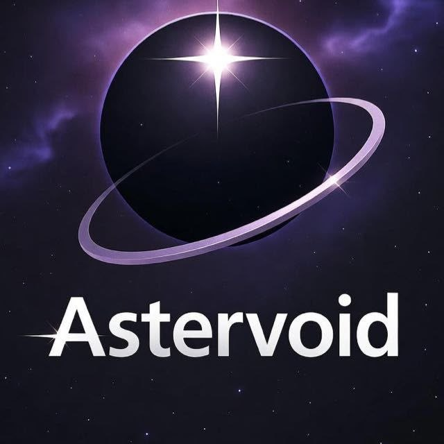

<p align="center">
  
</p>

# 🌌 astervoid-lang
 
> A custom programming language and compiler built from scratch as part of a Compiler Design course.

---

## 📖 Overview
 
**astervoid-lang** is a fully designed and implemented compiler for a custom language, covering all four major phases of compilation. Built collaboratively by a team of 3, the project spans everything from formal language specification to semantic analysis — supporting variables, arithmetic expressions, and control flow constructs.
 
---

## ✨ Features
 
- 🔤 **Custom Language Design** — Formally specified grammar and token set for *astervoid-lang*
- 🔍 **Scanner (Lexer)** — Tokenizes source code into a stream of meaningful symbols
- 🌳 **Parser** — Constructs a parse tree from the token stream using the defined grammar
- 🧠 **Semantic Analyzer** — Validates type correctness, scope rules, and symbol resolution
- 📦 **Symbol Table** — Tracks variable declarations and scope throughout the program
- ➕ **Arithmetic Expressions** — Full support for mathematical operations
- 🔀 **Control Flow** — Conditional and loop constructs
---

## 🗂️ Project Structure
 
```
astervoid-lang/
├── main.cpp                  # Entry point
├── .gitignore
├── README.md
└── implementation/
    ├── parseTree/
    │   ├── GenericParseTreeNode.h
    │   └── genericParseTreeNode.cpp
    ├── parser/
    │   ├── parser.h
    │   └── parser.cpp
    ├── scanner/
    │   ├── TokenType.h
    │   ├── scanner.h
    │   ├── scanner.cpp
    │   └── test.astv         # Sample source file in astervoid-lang
    └── semantic/
        ├── SemanticAnalyzer.h
        ├── SemanticAnalyzer.cpp
        ├── SymbolTable.h
        └── SymbolTable.cpp
```
